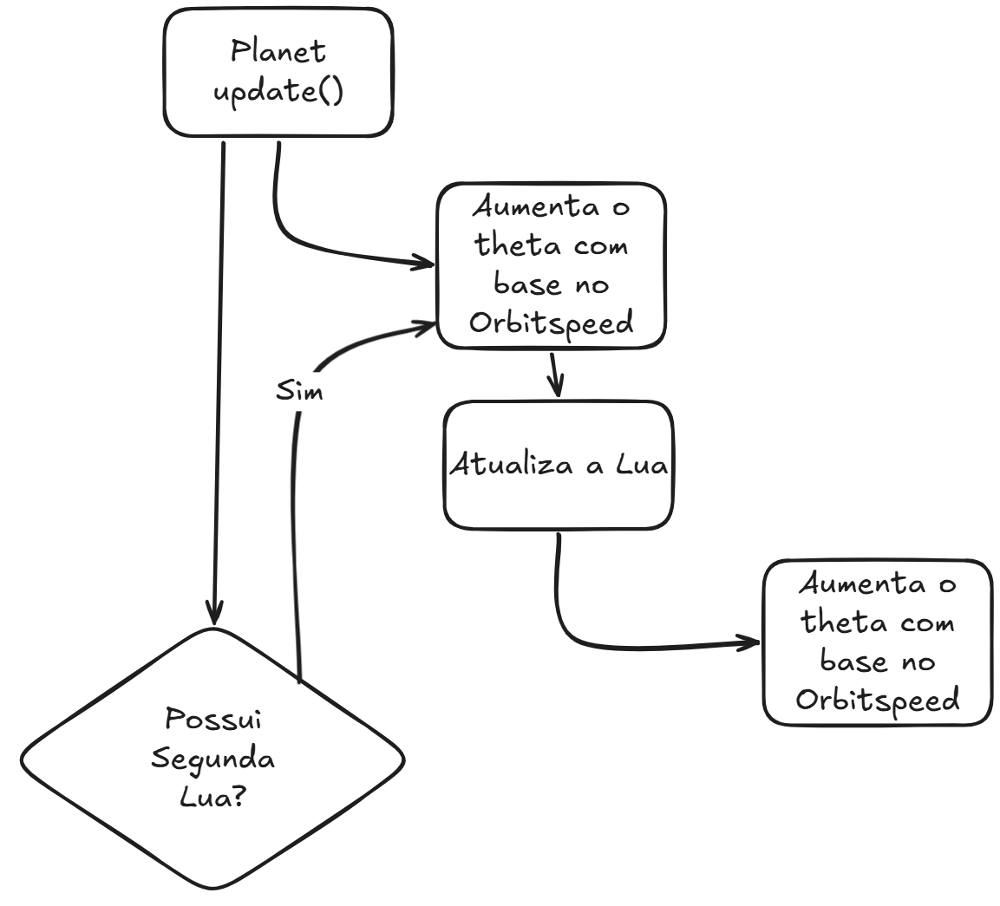

# Etapa 2

A incrementação do theta é feito dentro da função `update()` das classes `Planet` e `Moon`

A incrementação de theta é feita através do orbitspeed, que é um número aleatório gerado ao instânciar a classe.

No caso da classe `Planet`, é gerado nesta linha: `orbitspeed = random(0.01,0.03);`

Caso o planeta possua segunda lua, ele executa o `update()` da segunda lua também, se não, executa apenas da primeira lua.

No caso da classe `Moon`, é gerado nesta linha: `orbitspeed = random(-0.1,0.1);`

Como a geração do `orbitspeed` da lua abrange um número negativo, isso possibilita a movimentação antiorária das luas geradas.

# Etapa 4

## 1. Onde aplicamos `pushMatrix()` e `popMatrix()` e por quê?

- Aplicamos `pushMatrix()` e `popMatrix()` no `draw()` para centralizar o sistema no Sol sem afetar o restante do frame.
- Também usamos essas funções em `Planet.display()` para isolar a órbita de cada planeta e em `Moon.display()` para isolar a órbita de cada lua.
- O motivo é que `pushMatrix()` salva o sistema de coordenadas atual e `popMatrix()` restaura esse estado depois do desenho, evitando que uma transformação “vaze” para o próximo objeto.

## 2. O que mudaria se invertêssemos `rotate()` e `translate()` no planeta ou na lua?

- No planeta, usamos `rotate(theta)` antes de `translate(distance, 0)` para que ele gire ao redor do Sol; na lua, usamos a mesma lógica para que ela gire ao redor do planeta.
- Se invertêssemos para `translate()` e depois `rotate()`, o planeta ou a lua deixariam de orbitar corretamente, porque o objeto seria primeiro deslocado e depois apenas teria seu sistema local girado.
- Como o desenho é feito em `ellipse(0, 0, ...)`, essa rotação local quase não apareceria visualmente em um círculo, então o corpo tenderia a ficar parado na posição deslocada em vez de percorrer uma órbita circular.

## 3. Como garantimos que cada órbita é independente das demais?

- Garantimos a independência das órbitas com composição (`Planet` contém `moon` e pode conter `moon2`), atualização separada em `update()` e uso de matrizes aninhadas em cada `display()`.
- Assim, cada objeto mantém seu próprio `theta`, seu próprio `orbitspeed` e seu próprio bloco de transformação, o que permite variar velocidades, distâncias, cores e número de luas sem interferir nos demais corpos.
